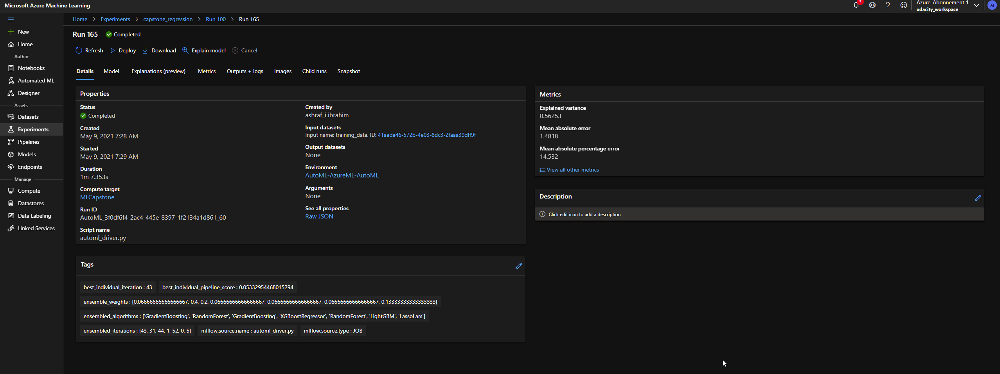
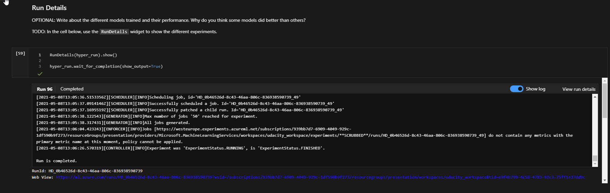
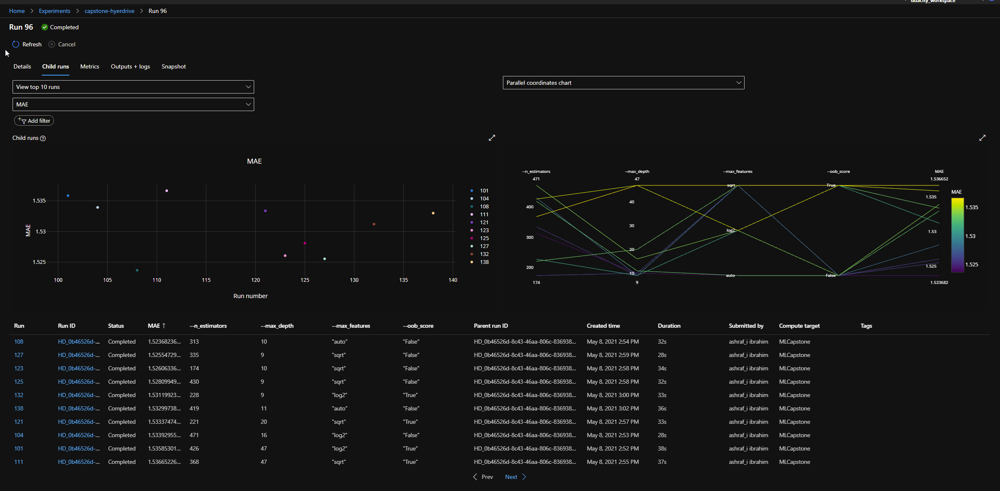
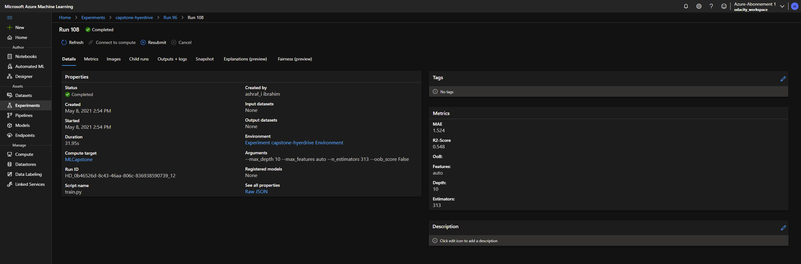
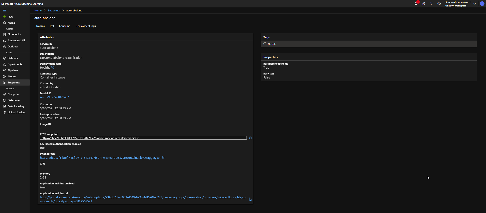
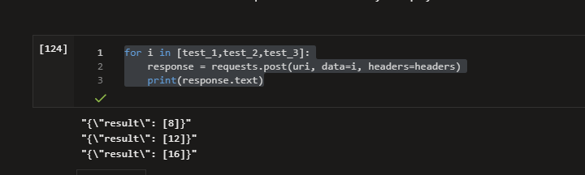

# Machine Learning Engineering Capstone

Author: Ashraf Ibrahim <br>
Date: 09.05.2021 <br>

## Introduction 

This is my Capstone Project for the Udacity Machine-Learning-Engineer for Azure ND. In this Poject, i am going to compete a Machine-Learning Model created via HyperDrive to a Model conducted with Azure AutoML. I have choosen the [Abalone-Dataset](http://archive.ics.uci.edu/ml/datasets/Abalone) from UCI ML Repository. The AutoML approach had the best result and thus this Model was deployed. Deplyoment and Testing of the API as well as some additional information can be seen on my [screencast](https://youtu.be/dIHwq81iypg).

## Project Set Up 

For this Project to run, you need to complete the following steps: 

+ Clone this Repository 
+ Create an Azure Account and a Machine-Learning Workspace
+ Upload the Dataset to Azure and name it ``abalone``
+ Upload all Scripts (train.py and both Jupyter Notebooks to your ML-Studio)
  + NOTE: Create a scripts folder on ML Studio or change the path of the train.py in your hyperdrive Notebook. 
+ Follow the Steps on each Notebook and see the Screencast for more Information 
+ Deploy your Model (e.g via Code in AutoML-Notebook)

## Dataset

The Abalone Dataset comes from a study conducted in 1994 and published with the title *The Population Biology of Abalone (Haliotis species) in Tasmania. I. Blacklip Abalone 		(H. rubra) from the North Coast and Islands of Bass Strait*. The Dataset has 4177 rows with 9 columns:

+ Sex 
+ Length
+ Diameter
+ Height
+ Weight.whole
+ Weight.shucked
+ Weight.viscera
+ Weight.shell 
+ Rings

The Label-Column - **Rings**, as a count of visible rings - can be used to determine the Age. The Dataset can be used with a Classification approach, defining the Rings as a Multi-Class label or as a Regression approach where the Rings are handeld as interger. The AutoML-Notebook compares both approaches to solve this Problem. In my Hyperdrive approach i am only using a Regression. 

All Features are used. The Dataset is not enhanced with additional Data. The Sex-feature is on-hot-encoded and all continous Variables are standardized. 

I have uploaded the Data to my Workspace.


In My HyperDrive ``train.py`` -Script the dataset is directly downloaded from my github.

## Automated ML

```python
# TODO: Put your automl settings here
automl_settings_reg = {'experiment_timeout_minutes': 40,
                   "max_concurrent_iterations": 4,
                   'primary_metric':'normalized_mean_absolute_error',
                   'task':'regression'}

# TODO: Put your automl config here
automl_config_reg = AutoMLConfig(compute_target=cluster,
                            training_data=dataset,
                            label_column_name='Rings',
                            enable_early_stopping= True,
                            featurization= 'auto',
                            debug_log = "automl.log",
                            **automl_settings_reg)
```

I have used an experiment with a timeount after 40 minutes, a *normalized_mean_absolute_error* as primary metric as an MAE is more interpretable as a MSE. 

While running, you can inspect the details of your run on in the RunDetails cell. 


Afterwards you can inspect the best Model. In my case it was a VotingClassifier based upon several Algorithm. Each Algorithm was weighted to adjust its impact on the VotingClassifier: 

+ GradientBoosting * 0.067
+ RandomForest * 0.4
+ GradientBoosting * 0.2
+ XGBoostRegressor * 0.067
+ RandomForest * 0.067
+ LightGBM * 0.067
+ LassoLars * 0.134




The Best Model achieved an MAE of 1.48 and thus indicating, that in mean the Algorithm is miscalculating the age by 1.48 Years. 

As the Dataset includes some *older* Abalones, the results may could be improved if those were treated as outliers and were excluded from the analysis. In generall increasing the runtime might lead to more Model-variants and thus can find better Results. Nevertheless the Results can be considerd as good.  

## Hyperparameter Tuning

```python
# TODO: Create an early termination policy. This is not required if you are using Bayesian sampling.
early_termination_policy = BanditPolicy(evaluation_interval=1,slack_factor=0.1)

#TODO: Create the different params that you will be using during training
param_sampling = RandomParameterSampling(
    {'--n_estimators':quniform(5,500,1),
    '--max_depth':quniform(5,50,1),
    '--max_features':choice('auto','sqrt','log2'),
    '--oob_score':choice('True','False')
    }
)

#TODO: Create your estimator and hyperdrive config
estimator = SKLearn(source_directory='./scripts',compute_target=cluster,entry_script='train.py',vm_priority='LowPriority')

hyperdrive_run_config = HyperDriveConfig(estimator=estimator,
                                        policy=early_termination_policy,
                                        hyperparameter_sampling=param_sampling,
                                        primary_metric_name='MAE',
                                        primary_metric_goal=PrimaryMetricGoal.MINIMIZE,
                                        max_total_runs=50,
                                        max_concurrent_runs=4)
```

My Hyperdrive approach used a RandomForest Regressor as  this is one often used regression Algorithm which leads to good results in regard to a decent runtime. I defined a set of Hyperparmeter, where i used a *RandomParameterSampling* on. Those Parameter were the Number of Estimators *n_estimators*, the *max_depth* of each Estimator, the amount of considered features *max_features* and the out of Bag score *oob_score*. 

I used a *BanditPolicy* to early terminate Parameter combinations with bad performance. As a lower MAE describes a better Result, the goal was set to minimize this Metric. I have set HyperDrive to do 50 runs.

The complete process of initiating and calculating took about 50 minutes as the RunDetails picture indicates.



In generall all Runs did achieve similar results, as the range of MAE-Values indicates in the following picture 





The Best MAE of 1.52 was achieved using the following Hyperparameters: 

+ n_estimators: 313
+ max_depth: 10
+ max_features: auto
+ oob_score: False 

## Model Deployment

As the best Model was achieved using the AutoML variant, i deployed this one. The best run was retrieved, registered and deployed using code. 

```python
# Retrieve best Model
best_run,model=remote_run_reg.get_output()

model_name=best_run.properties['model_name']

model_registered=remote_run.register_model(model_name=model_name, description="Abalone Model")

# Score Script
best_run.download_file("outputs/scoring_file_v_1_0_0.py","scripts/score.py")

# Environment Information
best_run.download_file(constants.CONDA_ENV_FILE_PATH, "conda_env.yml")
conda_environment = Environment.from_conda_specification(name='conda_env',file_path="conda_env.yml")

# Inference Config 
inference_config=InferenceConfig(entry_script="scripts/score.py", environment=conda_environment)

# Defininf ACI- Deployment
aci_config=AciWebservice.deploy_configuration(cpu_cores=1,memory_gb=2,description="capstone-abalone-classification",enable_app_insights=True,auth_enabled=True)

# Deploy 
service=Model.deploy(ws,"auto-abalone",[model_registered],inference_config,aci_config)

service.wait_for_deployment(True)

```

After the deployment is finished, you can inspect your Endpoint. 



As the REST-Endpoint is retrieved by code, you only need to copy your Primary Key to be able to test your Endpoint by using the following Code:  

```python
uri=service.scoring_uri

key='YOUR KEY HERE'

headers = {'Content-Type':'application/json'}

headers['Authorization'] = 'Bearer {}'.format(key)


test_1 = json.dumps({'data':[{
    'Length':0.46,
    'Diameter':0.36,
    'Height':0.10,
    'Whole weight':0.51,
    'Shucked weight':0.22,
    'Viscera weight':0.10,
    'Shell weight':0.15,
    'Sex_F':0,
    'Sex_I':0,
    'Sex_M':1}
    ]
        })

test_2 = json.dumps({'data':[{
    'Length':0.22,
    'Diameter':0.81,
    'Height':0.48,
    'Whole weight':0.53,
    'Shucked weight':0.35,
    'Viscera weight':0.15,
    'Shell weight':0.11,
    'Sex_F':1,
    'Sex_I':0,
    'Sex_M':0}
    ]
        })

test_3 = json.dumps({'data':[{
    'Length':0.36,
    'Diameter':0.25,
    'Height':0.15,
    'Whole weight':0.58,
    'Shucked weight':0.26,
    'Viscera weight':0.18,
    'Shell weight':0.21,
    'Sex_F':0,
    'Sex_I':1,
    'Sex_M':0}
    ]
        })
```

I have created three different datapoints, which are sent to Endpoint. For that to function, you have to look up your PrimaryKey after the API ist deployed and write it to the KEY-Variable. 

 

Sending those requests should let you get the response with the calculated ages of your Datapoints. 