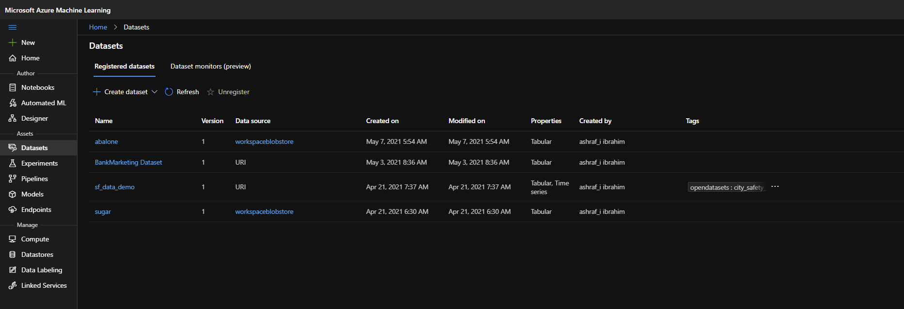
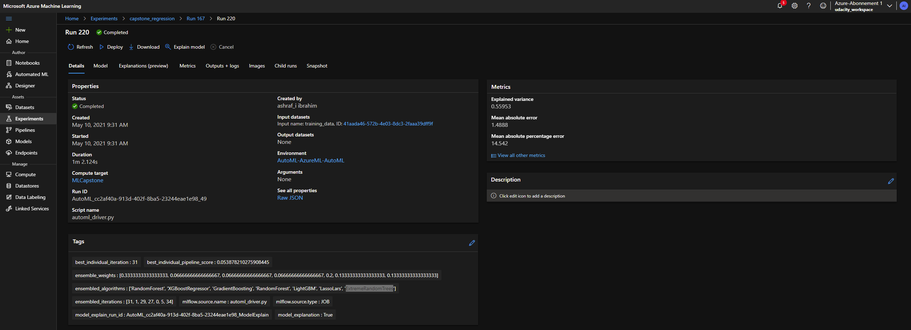
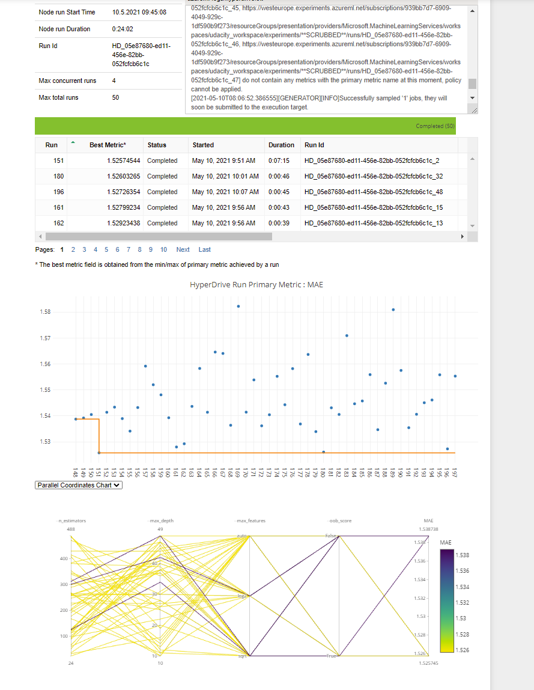
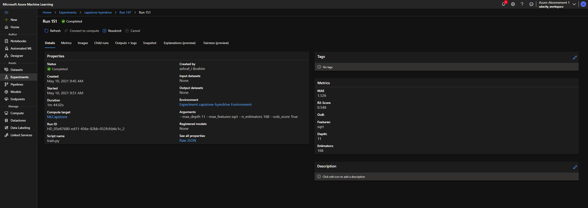
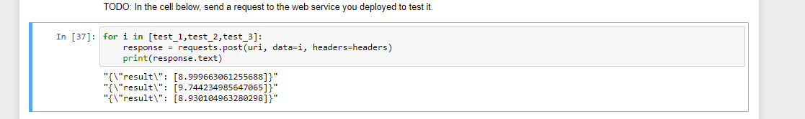

# Machine Learning Engineering Capstone

Author: Ashraf Ibrahim <br>
Date: 09.05.2021 <br>

## Introduction 

This is my Capstone Project for the Udacity Machine-Learning-Engineer for Azure ND. In this Poject, i am going to compete a Machine-Learning Model created via HyperDrive to a Model conducted with Azure AutoML. I have choosen the [Abalone-Dataset](http://archive.ics.uci.edu/ml/datasets/Abalone) from UCI ML Repository. The AutoML approach had the best result and thus this Model was deployed. Deplyoment and Testing of the API as well as some additional information can be seen on my [screencast](https://youtu.be/dmvLlk5IiV0).

## Project Set Up 

For this Project to run, you need to complete the following steps: 

+ Clone this Repository 
+ Create an Azure Account and a Machine-Learning Workspace
+ Upload the Dataset to Azure and name it ``abalone``
+ Upload all Scripts (train.py and both Jupyter Notebooks to your ML-Studio)
  + NOTE: Create a scripts folder on ML Studio or change the path of the train.py in your hyperdrive Notebook. 
+ Follow the Steps on each Notebook and see the Screencast for more Information 
+ Deploy your Model (e.g via Code in AutoML-Notebook)

## Dataset

The Abalone Dataset comes from a study conducted in 1994 and published with the title *The Population Biology of Abalone (Haliotis species) in Tasmania. I. Blacklip Abalone 		(H. rubra) from the North Coast and Islands of Bass Strait*. The Dataset has 4177 rows with 9 columns:

+ Sex 
+ Length
+ Diameter
+ Height
+ Weight.whole
+ Weight.shucked
+ Weight.viscera
+ Weight.shell 
+ Rings

The Label-Column - **Rings**, as a count of visible rings - can be used to determine the Age. The Dataset can be used with a Classification approach, defining the Rings as a Multi-Class label or as a Regression approach where the Rings are handeld as interger. The AutoML-Notebook compares both approaches to solve this Problem. In my Hyperdrive approach i am only using a Regression. 

All Features are used. The Dataset is not enhanced with additional Data. The Sex-feature is on-hot-encoded and all continous Variables are standardized. 

I have uploaded the Data to my Workspace using the GUI of Azure ML Studio and named the Dataset *abalone*.



Then it is consumeable in AzureSDK by using: 

```python
from azureml.core import Workspace, Dataset

subscription_id = 'YOUR SUBSCRIPTION'
resource_group = 'YOUR RG'
workspace_name = 'YOUR WS'

workspace = Workspace(subscription_id, resource_group, workspace_name)

dataset = Dataset.get_by_name(workspace, name='abalone')
dataset.to_pandas_dataframe()
```


In My HyperDrive ``train.py`` -Script the dataset is directly downloaded from my github.

## Automated ML

The Abalone Dataset is treated as classification as well as a regression Problem. As a Classification Problem, it is based upon a Multi-Class-classifictaion with several inbalanced classes. As a regression Problem it is easier to handle, as the labelcolumn is treated as integer and thus allowing to calculate inbetween states. In the literature both approachen are somites compared to each other. In my case, i used the AutoML approach to test both variants, but focusing on the Regression approach. Thus this is the approach i am going to focus on.

Nevertheless, *Rings* is the label, which describes the amount of visible Rings on an Abalone and can be used to describe its age (the more rings, the older the Abalone is). And thus making it very usefull for a Regression approach!   

```python
# TODO: Put your automl settings here
automl_settings_reg = {'experiment_timeout_minutes': 40,
                   "max_concurrent_iterations": 4,
                   'primary_metric':'normalized_mean_absolute_error',
                   'task':'regression'}

# TODO: Put your automl config here
automl_config_reg = AutoMLConfig(compute_target=cluster,
                            training_data=dataset,
                            label_column_name='Rings',
                            enable_early_stopping= True,
                            featurization= 'auto',
                            debug_log = "automl.log",
                            **automl_settings_reg)
```

I have configured a timeout after 40 minutes, to have some variance in the used Algorithm and thus allowing myself to know, if the runtime should be increased or lowered when i want to re-run the experiment. As a metric i have used the *normalized_mean_absolute_error* as primary metric as an MAE is more interpretable as a MSE. Thus the Errorrate tells us, how many years in mean an algorithm miscalculates the ture age. As i have set a Cluster with 5 nodes (i have used my private Azure account), i have defined the *max_concurrent_iterations* to be 4 and thus following the general rule of Nodes -1.  The *featurization* was set to *auto* to let the AutoML process decide by itself which features to include. Further information on this Process can be found [here](https://docs.microsoft.com/de-de/azure/machine-learning/how-to-configure-auto-features).  Lastly,  i have enabled the **early_stopping**, to reduce computational efforts and thus limiting my expences. 

While running, you can inspect the details of your run on in the RunDetails cell. 


Afterwards you can inspect the best Model. In my case it was a VotingEnsemble based upon several Algorithm. Each Algorithm was weighted to adjust its impact on the VotingClassifier: 

+ RandomForest * 0.33
+ XGBoostRegressor * 0.067
+ GradientBoosting * 0.067
+ RandomForest * 0.067
+ LightGBM * 0.2
+ LassoLars * 0.133
+ ExtremeRandomTrees * 0.133



The Best Model achieved an MAE of 1.49 and thus indicating, that in mean the Algorithm is miscalculating the age by 1.49 Years. 

## Hyperparameter Tuning

```python
# TODO: Create an early termination policy. This is not required if you are using Bayesian sampling.
early_termination_policy = BanditPolicy(evaluation_interval=1,slack_factor=0.1)

#TODO: Create the different params that you will be using during training
param_sampling = RandomParameterSampling(
    {'--n_estimators':quniform(5,500,1),
    '--max_depth':quniform(5,50,1),
    '--max_features':choice('auto','sqrt','log2'),
    '--oob_score':choice('True','False')
    }
)

#TODO: Create your estimator and hyperdrive config
estimator = SKLearn(source_directory='./scripts',compute_target=cluster,entry_script='train.py',vm_priority='LowPriority')

hyperdrive_run_config = HyperDriveConfig(estimator=estimator,
                                        policy=early_termination_policy,
                                        hyperparameter_sampling=param_sampling,
                                        primary_metric_name='MAE',
                                        primary_metric_goal=PrimaryMetricGoal.MINIMIZE,
                                        max_total_runs=50,
                                        max_concurrent_runs=4)
```

My Hyperdrive approach used a RandomForest Regressor as this is  an often used regression Algorithm which leads to good results in regard to a decent runtime. I defined a set of Hyperparmeter, where i used a *RandomParameterSampling* on. Those Parameter were the Number of Estimators *n_estimators*, the *max_depth* of each Estimator, the amount of considered features *max_features* and the out of Bag score *oob_score*. I have choosen those, because they are important parameters in a construction of a RandomForest.

The **Number of Estimators** is one of the most important Parameters in a RandomForest as this one defines the amount of Trees, that should be grown and thus influencing the majority Vote, which leads to the Result. The **Depth of a Tree** defines how deep a tree should grow and when a tree should be pruned; this determines how many splits a tree can do and thus balancing over- and unterfitting. For Both Parameters i decided to define an range around the default-values,to get some variance in my HyperDrive approaches.  **Max Features** describes which features should be used to define the best split. Here i offered the RandomSampling to choose between all possivle Variants. The **OOB Score** defines wether or not an out-of-bag score should be defined, which can be used as a generalization. As i have set bootstrapping to default, which equals True, there might a chance, that some data might always be neglected, and thus testing if a correction (oob_score) improves the Result is a good Practice. 

I used a *BanditPolicy* to early terminate Parameter combinations with bad performance. As a lower MAE describes a better Result, the goal was set to minimize this Metric. I have set HyperDrive to do 50 runs.

The complete process of initiating and calculating took about 50 minutes as the RunDetails picture indicates.



In generall all Runs did achieve similar results, as the range of MAE-Values indicates in the following picture 



The Best MAE of 1.52 was achieved using the following Hyperparameters: 

+ n_estimators: 168

+ max_depth: 11

+ max_features: sqrt

+ oob_score: True

  

## Model Deployment

As the best Model was achieved using the AutoML variant, i deployed this one. The best run was retrieved, registered and deployed using code.  Some specific files are needed to perform a deployment, the *score.py* and the *conde_env.yml*. Both files can be extracted form the specific best run. The *score.py* defines an entry script, which loads the trained model and processes input data. Further information can be read [here](https://docs.microsoft.com/de-de/azure/machine-learning/how-to-deploy-model-designer). The *conda_env.yml* defines environmental specifics, such as packages and versions to load. You can read more about it, on the link above. 

Both files are necessary to construct an *inference_config* file.  Further i used an ACI-Webservice (an Azure Container Instance) to deploy the Model into production. 

```python
# Retrieve best Model
best_run,model=remote_run_reg.get_output()

model_name=best_run.properties['model_name']

model_registered=remote_run.register_model(model_name=model_name, description="Abalone Model")

# Score Script
best_run.download_file("outputs/scoring_file_v_1_0_0.py","scripts/score.py")

# Environment Information
best_run.download_file(constants.CONDA_ENV_FILE_PATH, "conda_env.yml")
conda_environment = Environment.from_conda_specification(name='conda_env',file_path="conda_env.yml")

# Inference Config 
inference_config=InferenceConfig(entry_script="scripts/score.py", environment=conda_environment)

# Defininf ACI- Deployment
aci_config=AciWebservice.deploy_configuration(cpu_cores=1,memory_gb=2,description="capstone-abalone-classification",enable_app_insights=True,auth_enabled=True)

# Deploy 
service=Model.deploy(ws,"auto-abalone",[model_registered],inference_config,aci_config)

service.wait_for_deployment(True)

```

After the deployment is finished, you can inspect your Endpoint. 


As the REST-Endpoint is retrieved by code, you only need to copy your Primary Key to be able to test your Endpoint by using the following Code:  

```python
uri=service.scoring_uri

key='YOUR KEY HERE'

headers = {'Content-Type':'application/json'}

headers['Authorization'] = 'Bearer {}'.format(key)


test_1 = json.dumps({'data':[{
    'Length':0.46,
    'Diameter':0.36,
    'Height':0.10,
    'Whole weight':0.51,
    'Shucked weight':0.22,
    'Viscera weight':0.10,
    'Shell weight':0.15,
    'Sex_F':0,
    'Sex_I':0,
    'Sex_M':1}
    ]
        })

test_2 = json.dumps({'data':[{
    'Length':0.22,
    'Diameter':0.81,
    'Height':0.48,
    'Whole weight':0.53,
    'Shucked weight':0.35,
    'Viscera weight':0.15,
    'Shell weight':0.11,
    'Sex_F':1,
    'Sex_I':0,
    'Sex_M':0}
    ]
        })

test_3 = json.dumps({'data':[{
    'Length':0.36,
    'Diameter':0.25,
    'Height':0.15,
    'Whole weight':0.58,
    'Shucked weight':0.26,
    'Viscera weight':0.18,
    'Shell weight':0.21,
    'Sex_F':0,
    'Sex_I':1,
    'Sex_M':0}
    ]
        })
```

I have created three different datapoints, which are sent to Endpoint. For that to function, you have to look up your PrimaryKey after the API ist deployed and write it to the KEY-Variable. 

 

Sending those requests should let you get the response with the calculated ages of your Datapoints. 

## Further Improvements 

As the Dataset includes some *older* Abalones, the results may could be improved if those were treated as outliers and were excluded from the analysis. In generall increasing the runtime might lead to more Model-variants and thus can find better Results. Nevertheless the Results can be considerd as good.  

Another improvement could be done, by adding external data to the dataset. The data was gathered in a certain region in 1994, so adding weather data for example might enhance the explanatory power of a model. 

A further idea would be to take the Voting ensemble created by the AutoMl approach and to conduct a gridsearch on it, to try to tweak the model in its Hyperparameter a bit more. Nevertheless this might only lead to some micro improvements.
